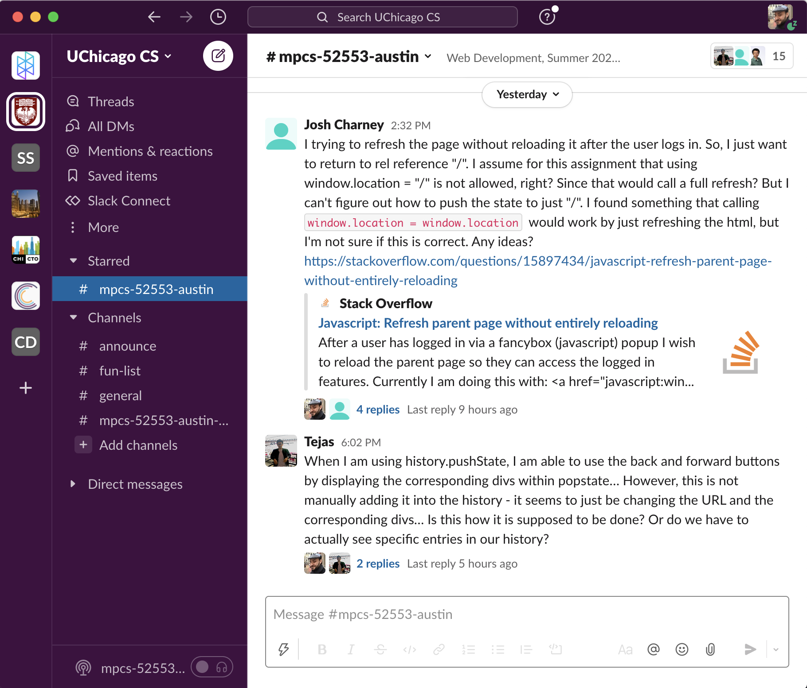

# Final Project: Belay (a Slack clone)

30 points

**DUE: Friday, March 18 by 5:30pm**
(Due Thursday March 10, with more generous grading, for graduating students)

Create your own repo at: https://classroom.github.com/a/6Xo735Fm

### Introduction

As a capstone project for Web Development, we're going to combine the various
front-end and back-end techniques we've learned over the course to produce a
modern, database-backed single-page application. Specifically, we'll be building
our own (significantly smaller in scope) version of the popular workplace
messaging app Slack. We'll call our version [Belay](https://en.wikipedia.org/wiki/Belaying).

### Requirements

- Belay lets users send and read real-time chat messages that are organized
  into rooms called Channels. Users see a list of all the channels on the server
  and can click one to enter that channel. Inside, they see all the messages
  posted to that channel by any user, and can post their own messages.
  All messages belong to a channel and all channels are visible to all users; we
  don't need to implement private rooms or direct messages.
- Any user can create a new channel by supplying a display name. Channel names
  must be unique. You may choose to limit what characters are allowed in channel
  names if you wish.
- Like Slack, messages may be threaded as Replies in response to a message in a
  channel. Messages in the channel will display how many replies they have if
  that number is greater than zero. We don't support nested threads;
  messages either belong directly to a channel or are replies in a thread to a
  message that does, but replies can't have nested replies of their own.

  You don't have to copy Slack's visual design, but for reference here is one way you might lay out a list of channels and the messages in one:

  Two-column layout:
  

- Like Slack, if a message contains any URLs that point to
  [valid image formats](https://developer.mozilla.org/en-US/docs/Web/HTML/Element/img#Supported_image_formats),
  display the images in the chat at the bottom of the message.
- The channel display indicates how many new messages have been posted to that
  channel that the user hasn't read yet. In the database, we track the highest
  message id a user has seen in each channel. Belay counts all messages in a
  channel as seen if the user is in the channel when they are posted or visits
  it after. You do not need to track whether messages get displayed on the
  screen.
- Belay should use responsive styling to render reasonably in a phone browser.
  In particular, on mobile devices, when a user is not in a channel they should
  see the list of channels, and when they are in a channel or in a thread they
  should see just the messages in that channel or thread, with some menu element
  to let them return to the channel list.
- Users should have a display name that they use to login with their password.
  It is not a requirement that the username or password be able to be changed or
  reset.
- Belay is a single-page web application. We serve a single HTML request on load
  and do not refresh the page. As users navigate to a channel, the application
  updates the navigation bar to reflect what channel they are in, and navigating
  to the URL for a specific channel opens the single-page application with that
  channel open. You may use Flask's `render_template` to render the page on
  first load if desired.
- Belay automatically sends non-blocking requests to the server to check for new
  channels and new messages in a channel. New messages in the channel the user
  is looking at are automatically considered to be read.
- Other than loading the initial page and serving static content like scripts,
  stylesheets, and images, all interaction with the Belay server is handled via
  JSON API requests. This includes authenticating users, retrieving channels and messages, and creating new channels and messages. These requests are served by
  a Flask API.
- All data about users, channels, and messages is stored in a SQLite database. In
  your submission, include a SQL file of commands that can be run to create the
  database and its tables. Start the names of your migration files with
  [ISO-8601](https://en.wikipedia.org/wiki/ISO_8601) datetimes so that graders
  can run them in order.
- You don't need to implement Slack features not listed here, like @-mentioning
  users, rich text or the like. If you have any questions about what is
  in scope, please ask on the [course Slack](https://app.slack.com/client/T71CT0472/C02TBJ5BHU2).

### Submissions and Grading

Graders will have Python 3.9+ with Flask installed, and a local install of
SQLite 3. Because graders must use the same environment to evaluate
submissions from multiple students, please do not require any additional
programs or packages to be installed. In your submission, include a README with
instructions for how to configure and run your app:
- First, graders will run your migrations in lexical order from the command line.
- Then, graders will start your app with a `flask run` command from the command
  line. Graders will have their FLASK_APP environment variable set to "app," so
  name your Flask file `app.py`.
- Graders will have the packages in `requirements.txt` installed with `pip3 install
  -r requirements.txt`. If you feel strongly that you need a package not listed
  there, ask on the course Slack.
- Graders will try to access your app in their browser at the URL that Flask
  prints to the command line, e.g. `* Running on http://127.0.0.1:5000/ (Press CTRL+C to quit)`
- Make sure that your app starts successfully under these circumstances. We'll
  do our best to make your app run even if it doesn't, but with a points penalty.

As always, remember to include in your submission any classmates you
collaborated with and any materials you consulted.

### Rubric (30 points possible - point values to be updated)

Database (7 points)
- Create database and tables with migrations in version control.
- A table for channels that stores a unique id and the channel name. That unique
  id may be an integer, or a slug like from Exercise 3
- A table for messages that stores, at a minimum, what channel the message is in,
  the user that wrote the message, and its text contents.
- A way of storing Replies. This could be a separate replies table, or in the
  messages table with a way of distinguishing messages in a channel from replies
  to a message, e.g. with a `replies_to` column.
- A join table holding the latest timestamp or message id seen for each user in
  each channel
- Store passwords securely by hashing them with bcrypt
- Sanitize all database inputs using prepared statements

API (8 points)
- Give API endpoints a unique path namespace to distinguish them from your HTML
  path(s) e.g. `/api/endpoint1`, `/api/encpoint2` etc.
- Authentication endpoint that accepts a username and password.
- Authenticate to other endpoints via session token in the request header (not
  as a URL param or in a request body)
- Use GET requests for API calls that don't change data on the server
- Use POST requests for API calls that change data on the server
- Endpoints to create and get channels and messages
- Endpoint to return unread message counts for the user for each channel
- Endpoint to update a user's last read message

UI and Responsive Layout (8 points)
- Prompt unauthenticaed users to sign in with their username and password, or to
  create an account. You do not need to support changing
- On wide screens, two-column layout to show the channel list in one column and
  the messages in one active channel or thread in the other column.
- When viewing replies, users can see the parent message they are replying to.
  They can click a button or link to navigate to the channel containing the
  parent message.
- On narrow screens, one-column layout with menu bar. Users see the channel list,
  the messages in one channel, or the replies to one message at a time, and not
  the other two.
- When viewing messages in a channel on a narrow screen, users have a button or
  link they can click to navigate back to the channel list.
- Parse image URLs that appear in messages and display the images at the end of
  the message. Hint: you may use the web to help you find an appropriate regular
  expression.
- Display the number of unread messages per channel
- For each message with replies, display the number of replies to that message.

Single-Page State (5 points)
- Only serve one HTML request
- Push the channel name (for messages) or parent message id (for replies) to the
  history and navigation bar when the user navigates to a channel or thread.
- Loading the unique URL of a channel or thread should open the app to that
  channel or thread.
- Users can use the Back button to navigate to a previous channel or thread
- Save the user's username and auth key in localStorage or in a cookie. Include
  your CNETID as part of your storage keys so your storage won't conflict with
  those of other students on the graders' machines.

Asynchronous Request Handling (2 points)
- Continuously poll for new messages, only in the channel the user is in. You
  may use setInterval.
- Continuously poll for which channels have new unread messages and how many.
  Use only one HTTP request to get counts for all channels. You may use
  setInterval.
